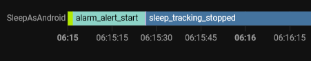

# Handywecker-steuert-Heimautomatisierung

**Frage**: Kann ich meine Beleuchtung einschalten, wenn mein Handy-Wecker klingelt?

Ja, ich weiß, das dieses eine rhetorische Frage ist. Klar geht das, es fallen euch jetzt bestimmt Hunterte von Möglichkeiten ein,
wie die Frage beantwortet kann.

Hier nur eine Variante davon...

### Links

* [Sleep as Android](https://sleep.urbandroid.org/)

## Hintergrund

In meiner Heimautomatisierung habe ich diverse Routinen eingerichtet um das morgentliche Aufstehen zu versüßen. Einschalten des Radios
auf einer leisen Lautstärke, sukzessive lauter werden lassen, Licht einschalten und ebenfalls mit der Zeit heller werden lassen.

Das Ganze funkitoniert, solange ich die Uhrzeit zum Wecken im Homeassistant einstelle, gut. Nun kommt es aber doch auch mal vor, dass man
zu einer anderen Zeit geweckt werden will. Dann nutze ich mein Handy "Hey Google, stelle den Wecker auf 6 Uhr".

Schön und gut, aber nun klingelt mein Handy um 6:00 Uhr **und** die HA-Routine läuft zu ihrer geplanten Zeit. Eigentlich will ich aber, dass
um 6:00 auch mein Radio und das Licht an gehen.

### das Problem

Wie verheirate ich mein Handy mit HA unter den folg. Prämissen:

1. ich möchte die bequeme *Hey-Google*-Variante nicht missen.
2. möglichst kostenlos! (also keine zusätzlichen Kosten)

## Lösungsskizze

Was benötigt ich hierfür? Vorne angefangen muss ich erstmal

* einen Wecker haben, welcher über Google Assistant gesteuert werden kann.
* Vom Wecker muss dann, beim Wecken, eine Nachricht an Homeassistant gesendet werden.
* Über diese Nachricht starte ich dann meinen o.g. Ablauf.

Das letzte ist kein Problem! Der erste Punkt auch nicht, hat mein Android-Telefon ja schon im Bauch. Punkt zwei hat es dann aber in sich. Der Android-Wecker
spricht dummerweise nicht! (Also Wecken ja, aber er informiert niemanden darüber, dass er es egtan hat). D.h. mit dem Standard-Wecker kann ich mein HA nicht
anschubsen um was zu tun.

Also muss eine andere Wecker-App her. Auf der Suche bin ich bei [Sleep as Android](https://sleep.urbandroid.org/) hängengeblieben. Die App nutze ich schon
lange, ob der diversen anderen Features (schöne Wecker-Töne, Einschlafmusik, Schlafaufzeichnung). Um's kurz zu machen:
Ja, *Sleep as Android* kann sowohl über den Google Assistant gesteuert werden, als auch "mit anderen sprechen".

## Konfiguration

Wie schon beschrieben kann *Sleep as Android* beide geforderten Punkte umsetzen.

### Assistant steuert SleepAsAndorid

Im regulären Setup wird der Assistant allerdings die *Uhr* als Wecker verwenden:


Dieses Verhalten konnte ich nur abstellen, in dem ich **die *Uhr* dekativiert habe**. Sämtliche Android-Einstellungen (als Standardprogramm öffnen, etc) haben
nichts gebracht, deinstallieren der *Uhr* ging nicht.

### SleepAsAndroid informiert Homeassistant

Als Zweites muss mein "Wecker" dann dem HomeAssistant noch sagen, dass "es klingelt". SleepAsAndroid hat einen eingebauten MQTT Client .... praktisch!


Im MQTT Broker habe ich natürtlich noch einen eigenen Account hierfür eingerichtet.

### Homeassistant Konfiguration

Auf der Seite <https://docs.sleep.urbandroid.org/services/automation.html#events> sind alle Events beschrieben, so dass hiermit die Automaitisuerungen
angestossen werden können. Der wichtigste Event ist -für mich- *alarm_alert_start*.

Hierzu wird in der `configuration.yaml` folgendes ergänzt:

```
mqtt:
  sensor:
    - name: "SleepAsAndroid"
      state_topic: "SleepAsAndroid"
      value_template: "{{value_json.event}}"

```

Womit ich eine Entität habe, deren Zustand ich einfach abfragen kann (klar, ich kann auch MQTT Auslöser definieren, aber so hat's mir besser gefallen,
da ich somit auch eine Historie im HA habe: 
)

```
alias: Wenn Handy klingelt schalte Radio ein
description: ""
trigger:

* platform: state
    entity_id:
  * sensor.sleepasandroid
    to: alarm_alert_start
condition: []
action:
* service: media_player.turn_on
    data: {}
    target:
      device_id: bb8e4072437648e647e2210dfd6cd4e4
mode: single
```
